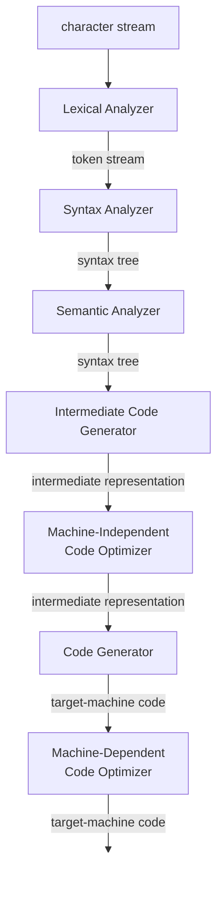

## 들어가며

[이전 글](/2026/05/07/컴파일러-목차-훑어보기)에서 Dragon Book의 목차를 훑어보았다. 이번 글에서는 1장 Introduction을 읽고 핵심 내용을 정리한다.

1장은 컴파일러의 전체 구조를 조감도처럼 보여주는 장이다. 컴파일러가 무엇인지, 내부적으로 어떤 단계를 거치는지, 프로그래밍 언어는 어떻게 발전해왔는지, 그리고 컴파일러 기술이 컴파일러 이외의 영역에서 어떻게 활용되는지를 다룬다.

---

## 1.1 Language Processors

**컴파일러(compiler)**는 소스 언어(source language)로 작성된 프로그램을 읽어서 타겟 언어(target language)로 된 등가 프로그램으로 번역하는 프로그램이다. 번역 과정에서 소스 프로그램의 오류를 보고하는 것도 컴파일러의 중요한 역할이다.

**인터프리터(interpreter)**는 번역된 타겟 프로그램을 생성하지 않고, 소스 프로그램에 명시된 연산을 입력에 대해 직접 실행한다.

|           | 컴파일러                | 인터프리터                  |
| --------- | ----------------------- | --------------------------- |
| 속도      | 빠름 (기계어 직접 실행) | 느림 (문장 단위 해석)       |
| 오류 진단 | 상대적으로 불리         | 문장 단위로 실행하므로 유리 |

Java는 두 방식을 결합한다. 소스 코드를 먼저 **바이트코드(bytecodes)**로 컴파일하고, 이를 가상 머신(VM)이 해석한다. JIT(Just-In-Time) 컴파일러는 바이트코드를 기계어로 번역하여 성능을 높인다.

실행 파일이 만들어지기까지의 전체 흐름은 다음과 같다.

```
소스 프로그램
  → 전처리기(Preprocessor)
  → 수정된 소스 프로그램
  → 컴파일러(Compiler)
  → 타겟 어셈블리 프로그램
  → 어셈블러(Assembler)
  → 재배치 가능 기계 코드
  → 링커/로더(Linker/Loader) ← 라이브러리, 재배치 가능 오브젝트 파일
  → 타겟 기계 코드
```

---

## 1.2 The Structure of a Compiler

컴파일러는 크게 **분석(analysis, front end)**과 **합성(synthesis, back end)** 두 부분으로 나뉜다.

- **분석**: 소스 프로그램을 구성 요소로 분해하고 문법 구조를 파악하여 중간 표현(IR)을 생성한다. 정보를 **심볼 테이블(symbol table)**에 저장한다.
- **합성**: 중간 표현과 심볼 테이블로부터 타겟 프로그램을 구성한다.

컴파일러 내부의 각 단계(phase)를 그림으로 나타내면 다음과 같다.



각 단계를 순서대로 살펴보자.

### 1.2.1 Lexical Analysis

**어휘 분석(lexical analysis, scanning)**은 컴파일러의 첫 번째 단계다. 문자 스트림을 의미 있는 단위인 **렉심(lexeme)**으로 그룹화하고, 각 렉심에 대해 **토큰(token)**을 생성한다.

토큰은 `⟨token-name, attribute-value⟩` 형태다.

여기서 **렉심(lexeme)**과 **토큰(token)**의 차이를 짚고 넘어가자. 렉심은 소스 코드에서 잘라낸 원본 텍스트이고, 토큰은 그 렉심을 추상적으로 분류한 표현이다. 예를 들어 `position = initial + rate * 60`이라는 문장에서:

| 렉심 (실제 문자열) | 토큰 (추상 표현) |
| ------------------ | ---------------- |
| `position`         | `⟨id, 1⟩`        |
| `=`                | `⟨=⟩`            |
| `initial`          | `⟨id, 2⟩`        |
| `+`                | `⟨+⟩`            |
| `rate`             | `⟨id, 3⟩`        |
| `*`                | `⟨*⟩`            |
| `60`               | `⟨60⟩`           |

`position`, `initial`, `rate`는 각각 다른 렉심이지만, 토큰으로는 모두 같은 종류인 `id`(identifier)로 분류된다. 숫자(1, 2, 3)는 심볼 테이블에서 각 변수를 구별하기 위한 포인터다.

이 문장의 토큰 스트림은 다음과 같다.

```
⟨id,1⟩ ⟨=⟩ ⟨id,2⟩ ⟨+⟩ ⟨id,3⟩ ⟨*⟩ ⟨60⟩
```

### 1.2.2 Syntax Analysis

**구문 분석(syntax analysis, parsing)**은 토큰 스트림으로부터 문법 구조를 나타내는 **구문 트리(syntax tree)**를 생성한다.

트리의 각 내부 노드는 연산을 나타내고, 자식 노드는 해당 연산의 인자를 나타낸다. 연산자 우선순위가 자연스럽게 반영된다. 예를 들어 `position = initial + rate * 60`의 구문 트리는 다음과 같다.

```
          =
         / \
     ⟨id,1⟩  +
           / \
       ⟨id,2⟩  *
             / \
         ⟨id,3⟩ 60
```

`rate * 60`이 `initial + ...`보다 트리의 더 깊은 곳에 위치하므로 먼저 계산된다. 곱셈이 덧셈보다 높은 우선순위를 가진다는 것을 트리 구조가 명시적으로 표현한다.

### 1.2.3 Semantic Analysis

**의미 분석(semantic analysis)**은 구문 트리와 심볼 테이블을 사용하여 소스 프로그램이 언어 정의에 맞는지 의미적 일관성을 검사한다.

핵심은 **타입 검사(type checking)**다. 예를 들어, 배열 인덱스에 부동소수점 수를 사용하면 오류를 보고한다. 필요한 경우 **타입 변환(coercion)**을 수행한다. `rate * 60`에서 `rate`이 float이고 `60`이 int이면, 의미 분석기는 `int_to_float(60)` 노드를 삽입한다.

```
          =
         / \
     ⟨id,1⟩  +
           / \
       ⟨id,2⟩  *
             / \
         ⟨id,3⟩ int_to_float
                    |
                   60
```

### 1.2.4 Intermediate Code Generation

구문 및 의미 분석 후, 많은 컴파일러가 저수준의 **중간 표현(intermediate representation)**을 생성한다. **3-주소 코드(three-address code)**가 대표적이며, 명령어당 최대 하나의 연산자만 가진다.

```
t1 = int_to_float(60)
t2 = id3 * t1
t3 = id2 + t2
id1 = t3
```

중간 표현은 두 가지 성질을 가져야 한다: **생성이 쉽고**, **타겟 머신 코드로의 변환이 쉬워야** 한다.

### 1.2.5 Code Optimization

머신 독립적인 **코드 최적화** 단계에서 중간 코드를 개선한다. 더 빠른 실행, 더 짧은 코드, 더 적은 전력 소비 등이 목표다.

예를 들어, 위 코드에서 `int_to_float(60)`은 컴파일 시간에 계산 가능하므로 60.0으로 대체할 수 있고, `t3`은 한 번만 사용되므로 제거할 수 있다.

```
t1 = id3 * 60.0
id1 = id2 + t1
```

### 1.2.6 Code Generation

**코드 생성** 단계에서 중간 표현을 타겟 머신 코드로 변환한다. 변수에 레지스터나 메모리 위치를 할당하는 것이 핵심이다.

```assembly
LDF  R2, id3
MULF R2, R2, #60.0
LDF  R1, id2
ADDF R1, R1, R2
STF  id1, R1
```

### 1.2.7 Symbol-Table Management

**심볼 테이블**은 변수명과 그 속성(타입, 스코프, 인자 정보, 반환 타입 등)을 기록하는 데이터 구조다. 컴파일러의 모든 단계에서 사용된다.

앞의 `position = initial + rate * 60` 예시에서 심볼 테이블은 다음과 같이 구성된다.

| 번호 | 이름     | 속성 |
| ---- | -------- | ---- |
| 1    | position | ...  |
| 2    | initial  | ...  |
| 3    | rate     | ...  |

토큰 `⟨id, 1⟩`의 숫자 1이 바로 이 심볼 테이블의 1번 항목(position)을 가리키는 포인터다.

### 1.2.8 The Grouping of Phases into Passes

여러 단계를 하나의 **패스(pass)**로 묶을 수 있다. 예를 들어 front-end 단계(어휘 분석, 구문 분석, 의미 분석, 중간 코드 생성)를 하나의 패스로 묶을 수 있다.

front end와 back end를 분리 설계하면, 서로 다른 소스 언어/타겟 머신 조합을 유연하게 지원할 수 있다.

### 1.2.9 Compiler-Construction Tools

컴파일러 구축에 사용되는 전문 도구들이 있다.

- **Parser generators**: 문법 기술로부터 구문 분석기를 자동 생성
- **Scanner generators**: 정규 표현식으로부터 어휘 분석기를 생성
- **Syntax-directed translation engines**: 파스 트리를 순회하며 중간 코드를 생성
- **Code-generator generators**: 중간 언어 연산을 머신 코드로 변환하는 규칙 모음에서 코드 생성기를 생성
- **Data-flow analysis engines**: 프로그램 내 값의 흐름 정보를 수집 (코드 최적화의 핵심)

---

## 1.3 The Evolution of Programming Languages

### 1.3.1 The Move to Higher-level Languages

1940년대 기계어 → 1950년대 어셈블리어 → 1950년대 후반 Fortran, Cobol, Lisp 등 고급 언어가 등장했다.

프로그래밍 언어는 여러 기준으로 분류할 수 있다.

- **세대별**: 1세대(기계어), 2세대(어셈블리), 3세대(Fortran, C, Java 등), 4세대(SQL 등), 5세대(Prolog 등)
- **패러다임별**: 명령형(C, Java) vs 선언형(ML, Haskell, Prolog)
- **기타**: 폰 노이만 언어, 객체지향 언어(C++, Java), 스크립팅 언어(Python, Ruby, Perl)

### 1.3.2 Impacts on Compilers

프로그래밍 언어와 컴퓨터 아키텍처의 발전은 컴파일러에 끊임없이 새로운 요구사항을 부여했다. 컴파일러는 고급 언어의 실행 오버헤드를 최소화하여 고급 언어의 사용을 촉진하는 핵심 역할을 한다.

컴파일러 작성은 도전적이다. 현대의 컴파일러는 수백만 줄의 코드로 이루어진 거대한 프로그램이며, 잠재적으로 무한한 소스 프로그램을 정확하게 번역해야 한다.

---

## 1.4 The Science of Building a Compiler

### 1.4.1 Modeling in Compiler Design and Implementation

컴파일러 설계에서 사용하는 핵심 수학적 모델들이 있다.

- **유한 상태 기계(finite-state machines)**와 **정규 표현식(regular expressions)**: 어휘 단위(키워드, 식별자 등)를 기술하고 인식하는 알고리즘에 사용
- **문맥 자유 문법(context-free grammars)**: 프로그래밍 언어의 구문 구조(괄호 중첩, 제어 구조 등)를 기술
- **트리(trees)**: 프로그램 구조를 표현하고 오브젝트 코드로 번역

### 1.4.2 The Science of Code Optimization

"최적화"라는 용어는 사실 오해의 소지가 있다. 컴파일러가 생성한 코드가 같은 작업을 수행하는 다른 어떤 코드보다 빠르거나 좋다고 보장할 수는 없기 때문이다.

컴파일러 최적화는 4가지 설계 목표를 충족해야 한다.

1. **정확성(correctness)**: 프로그램의 의미를 보존해야 한다 - 가장 중요
2. **성능 향상**: 많은 프로그램의 성능을 개선해야 한다
3. **합리적인 컴파일 시간**: 빠른 개발-디버깅 사이클을 지원해야 한다
4. **관리 가능한 엔지니어링 노력**: 시스템이 단순하고 유지보수 가능해야 한다

---

## 1.5 Applications of Compiler Technology

컴파일러 기술은 컴파일러 자체를 넘어 다양한 영역에서 활용된다.

### 1.5.1 Implementation of High-Level Programming Languages

고급 언어의 추상화는 편리하지만 실행 오버헤드를 유발한다. 최적화 컴파일러가 이 오버헤드를 상쇄한다.

대표적인 예로, C의 `register` 키워드가 있다. 1970년대에는 프로그래머가 직접 레지스터를 지정할 수 있게 했지만, 컴파일러의 레지스터 할당 기술이 발전하면서 이 키워드는 불필요해졌다. 오히려 프로그래머의 판단보다 컴파일러의 할당이 더 나은 경우가 많다.

객체지향 언어에서는 **프로시저 인라이닝(procedure inlining)**과 **가상 메서드 디스패치 최적화**가 중요하다.

#### 보충 설명: 프로시저 인라이닝 (Procedure Inlining)

함수 호출을 함수 본문 코드로 직접 대체하는 최적화다. 함수 호출에는 스택 프레임 생성, 인자 복사, 점프, 반환 등의 오버헤드가 있는데, 인라이닝하면 이를 제거할 수 있다. 객체지향 언어는 작은 메서드가 많아서 특히 효과적이다.

```java
// 인라이닝 전
int result = add(a, b);
int add(int x, int y) { return x + y; }

// 인라이닝 후
int result = a + b;  // 함수 호출 없이 직접 계산
```

#### 보충 설명: 가상 메서드 디스패치 최적화

다형성에서 오는 오버헤드를 줄이는 최적화다. 가상 메서드 호출은 vtable(가상 메서드 테이블)을 통한 간접 호출이라 직접 호출보다 느리다. 컴파일러가 분석을 통해 실제 타입을 추론할 수 있으면 직접 호출로 바꾸거나, 더 나아가 인라이닝까지 적용할 수 있다.

```java
Animal animal = getAnimal(); // Dog? Cat?
animal.speak();              // 어떤 speak()을 호출할지 런타임에 결정
```

### 1.5.2 Optimizations for Computer Architectures

**병렬성(Parallelism)**

- **명령어 수준 병렬성(ILP)**: 하드웨어가 순차 명령어 스트림에서 의존성을 검사하여 가능한 것을 병렬 실행. 컴파일러가 명령어를 재배열하여 이를 더 효과적으로 만들 수 있다.
- **프로세서 수준 병렬성**: 멀티프로세서에서 순차 프로그램을 자동으로 병렬 코드로 변환.

**메모리 계층(Memory Hierarchies)**

- 레지스터 → 캐시 → 메인 메모리 → 보조 저장장치 순으로 빠르지만 작다.
- 레지스터를 효율적으로 사용하는 것이 가장 중요한 최적화 문제다.
- 데이터 레이아웃이나 접근 순서를 변경하여 캐시 효율을 높일 수도 있다.

### 1.5.3 Design of New Computer Architectures

**RISC (Reduced Instruction-Set Computer)**: 컴파일러 최적화가 복잡한 명령어를 단순한 명령어 조합으로 대체할 수 있다는 관찰에서 탄생했다. 단순한 명령어 세트를 설계하면 컴파일러가 효과적으로 사용할 수 있고, 하드웨어 최적화도 쉽다. PowerPC, SPARC, MIPS, Alpha 등이 RISC 기반이다.

**특수 아키텍처**: 데이터 흐름 머신, 벡터 머신, VLIW, SIMD, 시스톨릭 어레이 등 다양한 아키텍처가 제안되었고, 각각에 대응하는 컴파일러 기술이 함께 발전했다.

### 1.5.4 Program Translations

- **바이너리 번역**: 한 머신의 바이너리 코드를 다른 머신용으로 변환 (예: Apple의 MC68040 → PowerPC 전환 시 사용)
- **하드웨어 합성**: Verilog/VHDL 기술을 게이트와 트랜지스터로 변환
- **데이터베이스 쿼리 인터프리터**: SQL 쿼리를 해석하거나 컴파일
- **컴파일된 시뮬레이션**: 시뮬레이터를 인터프리터 방식 대신 컴파일하여 수 배 이상 빠르게 실행

### 1.5.5 Software Productivity Tools

컴파일러 최적화를 위해 개발된 기술들이 소프트웨어 품질 향상에도 활용된다.

- **타입 검사(Type Checking)**: 프로그램 내 불일치 탐지. 보안 취약점(악의적 문자열 등) 탐지에도 활용
- **범위 검사(Bounds Checking)**: C의 배열 경계 검사 부재로 인한 버퍼 오버플로 방지
- **메모리 관리 도구**: Purify 같은 도구로 메모리 누수 동적 탐지

---

## 1.6 Programming Language Basics

### 1.6.1 The Static/Dynamic Distinction

- **정적 정책(static policy)**: 컴파일 시간에 결정할 수 있는 사안. 예: **정적 스코프(static scope, lexical scope)** - 프로그램 텍스트만 보고 선언의 스코프를 결정할 수 있음
- **동적 정책(dynamic policy)**: 프로그램 실행 시에만 결정할 수 있는 사안. 예: **동적 스코프(dynamic scope)** - 같은 이름 x가 실행 시점에 따라 다른 선언을 참조

대부분의 언어(C, Java)는 정적 스코프를 사용한다.

### 1.6.2 Environments and States

이름이 값과 연결되는 과정은 두 단계 매핑으로 설명할 수 있다.

```
이름(names) → [환경(environment)] → 위치(locations) → [상태(state)] → 값(values)
```

- **환경(environment)**: 이름을 메모리 위치(l-value)에 매핑
- **상태(state)**: 메모리 위치를 값(r-value)에 매핑

### 1.6.3 Static Scope and Block Structure

**블록 구조(block structure)**란 블록이 중첩될 수 있는 언어의 특성이다. C에서는 `{}`로 블록을 구분한다.

정적 스코프 규칙: 이름 x의 선언 D가 블록 B에 속하면, D의 스코프는 B 전체다. 단, B 안에 중첩된 블록 B'에서 x가 재선언되면 B' 내부는 제외된다.

### 1.6.4 Explicit Access Control

`public`, `private`, `protected` 키워드를 통해 클래스 멤버에 대한 접근을 제어한다. 이는 **캡슐화(encapsulation)**를 지원한다.

### 1.6.5 Dynamic Scope

**동적 스코프**에서 이름 x의 사용은 가장 최근에 호출된 프로시저 중 x 선언을 가진 프로시저의 선언을 참조한다.

정적 규칙이 "공간(코드 텍스트에서의 위치)"에 기반한다면, 동적 규칙은 "시간(호출 순서)"에 기반한다.

실제로 동적 스코프가 사용되는 경우: C 매크로 확장, 객체지향에서의 다형적 메서드 해석(method resolution).

### 1.6.6 Parameter Passing Mechanisms

- **Call-by-Value**: 실제 매개변수의 값을 복사하여 전달. C, Java에서 사용. Java에서 객체 전달 시 참조(포인터)의 값을 복사하므로 사실상 call-by-reference와 같은 효과
- **Call-by-Reference**: 실제 매개변수의 주소를 전달. C++의 ref 매개변수에서 사용. 큰 객체 전달 시 복사 비용을 피할 수 있음
- **Call-by-Name**: 실제 매개변수를 형식 매개변수에 텍스트적으로 대체. Algol 60에서 사용되었으나 직관적이지 않은 동작 때문에 현재는 거의 사용되지 않음

### 1.6.7 Aliasing

Call-by-reference 전달이나 Java에서 객체 참조를 전달할 때, 두 형식 매개변수가 같은 메모리 위치를 가리킬 수 있다. 이를 **앨리어싱(aliasing)**이라 한다.

앨리어싱을 이해하는 것은 컴파일러 최적화에 필수적이다. 변수가 앨리어싱되어 있으면 단순한 값 치환 최적화가 잘못된 결과를 낳을 수 있기 때문이다.

---

## 1.7 Summary of Chapter 1

1장에서 다룬 핵심 개념을 정리하면 다음과 같다.

- **언어 처리기**: 컴파일러, 인터프리터, 어셈블러, 링커, 로더 등
- **컴파일러 단계**: 어휘 분석 → 구문 분석 → 의미 분석 → 중간 코드 생성 → 코드 최적화 → 코드 생성
- **컴파일러 설계의 수학적 모델**: 오토마타, 문법, 정규 표현식, 트리
- **코드 최적화**: 정확성이 최우선, 완벽한 최적화는 불가능
- **컴파일러 기술의 응용**: 고급 언어 구현, 아키텍처 최적화, 바이너리 번역, 소프트웨어 보안 도구
- **프로그래밍 언어 기초**: 정적/동적 스코프, 환경과 상태, 블록 구조, 매개변수 전달 방식, 앨리어싱
